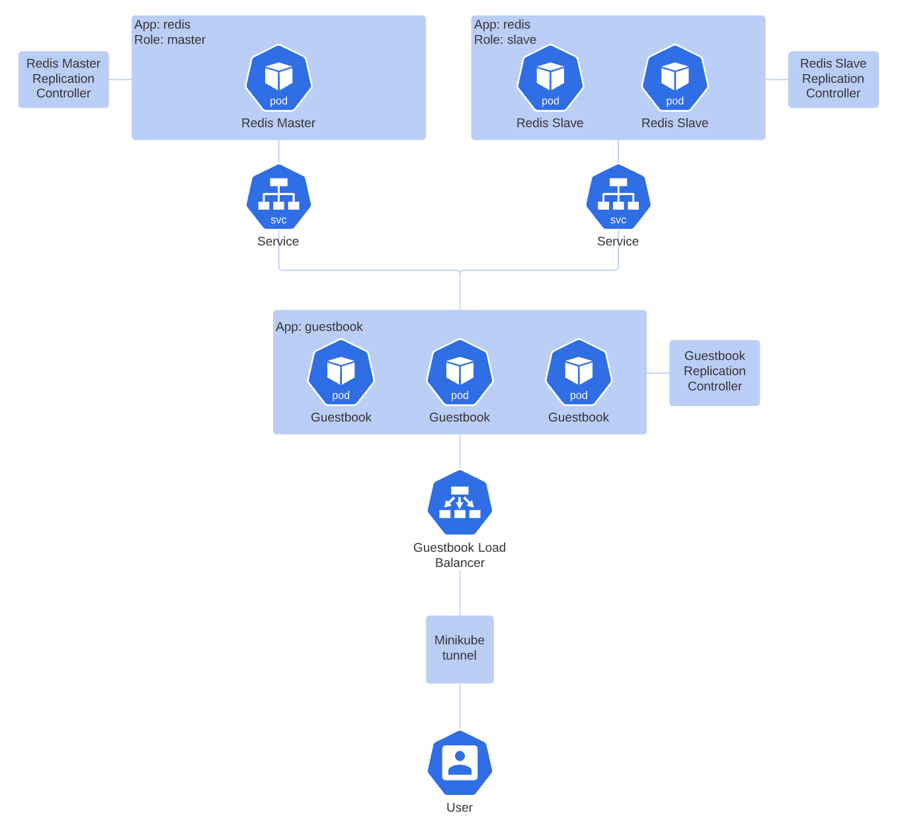

# Tarea2

#### Ejercicio 2.3 - Guestbook

  * Objetivo: Crear una aplicación en containers con Kubernetes que consta de una interfaz web con un servidor en Go, mediante la que se modifica y lee una base de datos Key-value de Redis.
  * Arquitectura:

  * Funcionalidad: Añadir y visualizar nombres en la interfaz web de un guestbook.
  * Otros: Se utiliza Minikube para el ambiente local y se ejecuta el comando `minikube tunnel` para exponer el puerto del Load Balancer (servicio del Guestbook) de la aplicación al host. De no realizarse este paso, el IP del Load Balancer aparece como `Pending`. Cabe resaltar que si la aplicación hubiera sido deployada en un ambiente en la nube (GCloud, AWS, Azure) este paso no sería necesario.

