# Tarea2

#### Ejercicio 2.1
Ejecutar un cluster con minikube.

```
minikube start

# Verificar
kubectl get nodes -owide
kubectl cluster-info
```

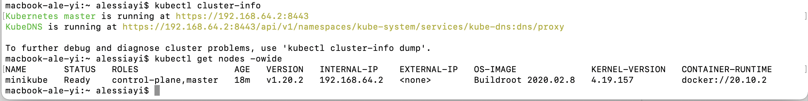

#### Ejercicio 2.2
Ejecutar un cluster multinodo con minikube.

```
minikube start --nodes 3

# Verificar
kubectl get nodes
minikube status
```

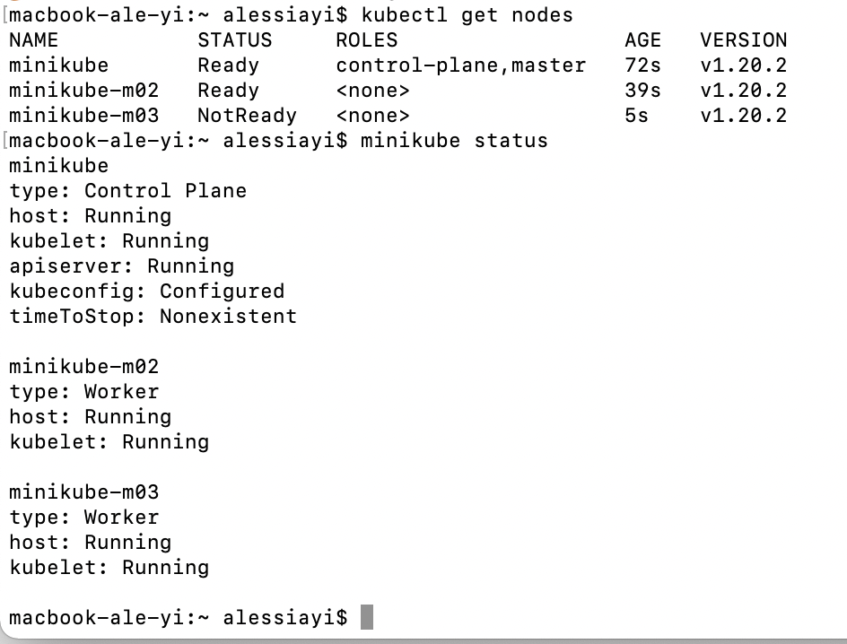

#### Ejercicio 2.3 - Guestbook

  * Objetivo: Crear una aplicación en containers con Kubernetes que consta de una interfaz web con un servidor en Go, mediante la que se modifica y lee una base de datos Key-value de Redis.
  * Arquitectura:


  * Funcionalidad: Añadir y visualizar nombres en la interfaz web de un guestbook.
  * Otros: Se utiliza Minikube para el ambiente local y se ejecuta el comando `minikube tunnel` para exponer el puerto del Load Balancer (servicio del Guestbook) de la aplicación al host. De no realizarse este paso, el IP del Load Balancer aparece como `Pending`. Cabe resaltar que si la aplicación hubiera sido deployada en un ambiente en la nube (GCloud, AWS, Azure) este paso no sería necesario.

#### Ejercicio 2.4
1. Ejecutar minikube con el perfil `guestbook-multinode` y con 3 nodos
```sh
minikube start -p guestbook-multinode --nodes 3
```

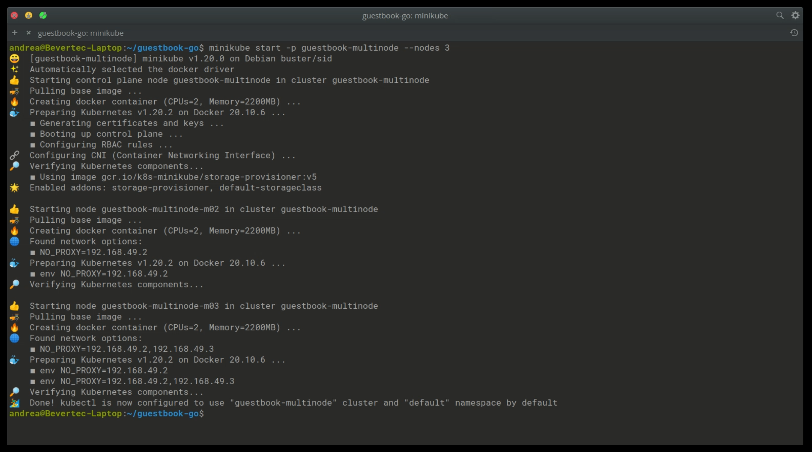

2. Verificar que los nodos se hayan creado correctamente
```sh
# Desde minikube
minikube status -p guestbook-multinode

# Desde kubectl
kubectl get nodes
```

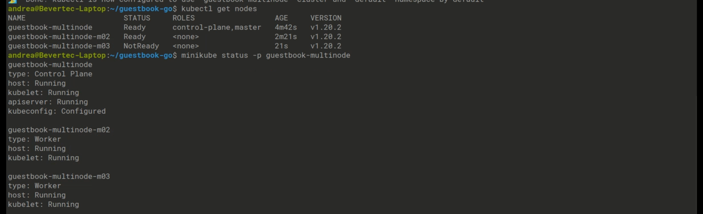

3. Crear services, replication controllers y pods desde el template
```sh
kubectl create -f 2.4/guestbook.yaml
```

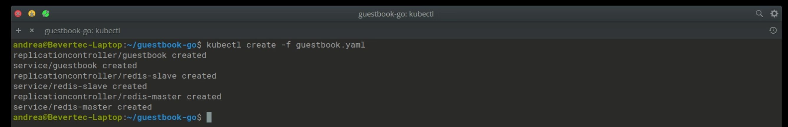

4. Verificar que los objetos se hayan creado correctamente.
  - Los pods pueden tardar unos minutos en crearse. Verificar hasta que la columna Ready este en 1/1
  - En services notar que el External_IP de guestbook aparece como \<pending\>

```sh
# Replication Controllers
kubectl get rc

# Services
kubectl get services con labels (como app=redis, role=master)

# Pods
kubectl get pods
```

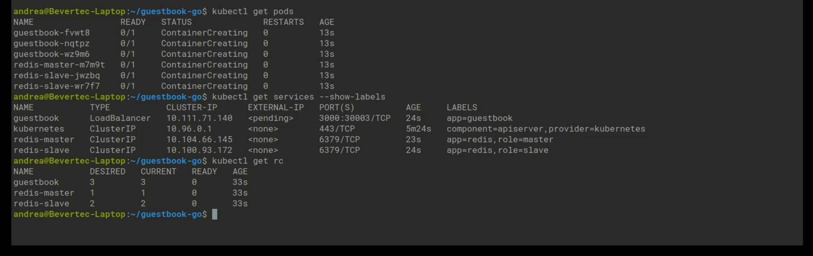

5. Exponer el puerto de guestbook al host para poder ingresar a la aplicación.
  - Abrir un tunel con minikube.
  - Correr en un terminal separado en paralelo.
```
minikube -p guestbook-multinode tunnel
```

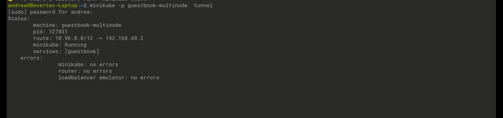

6. Mientras el tunel de minikube se encuentra abierto, buscar el EXTERNAL_IP asignado a guestbook nuevamente.
```
kubectl get services
```

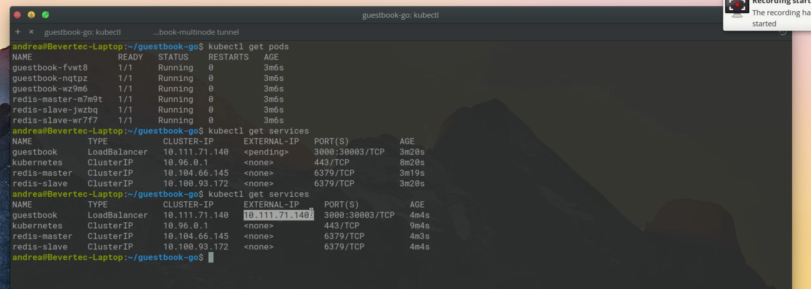

7. Ingresar a la IP encontrada en el paso anterior en el puerto 3000.
8. Aparece la interfaz del Guestbook.

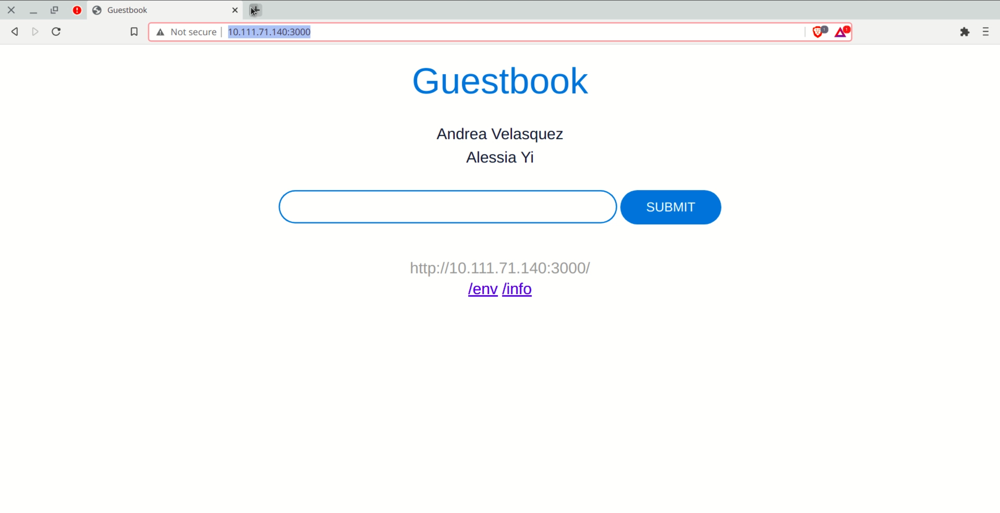

Video de demostración y explicación
[ver demo](2.4/2.4.mp4)

#### Ejercicio 2.5
##### Diagrama de alto nivel
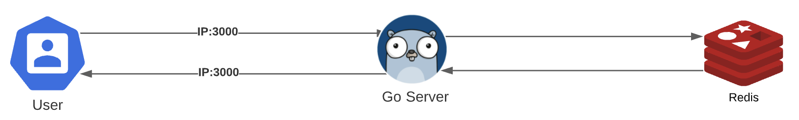
##### Diagrama de bajo nivel
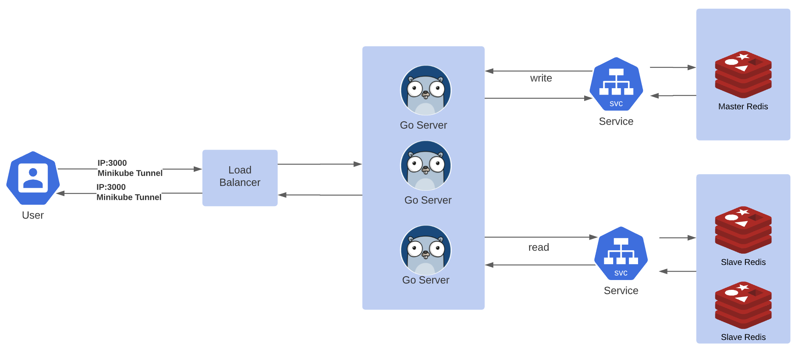


